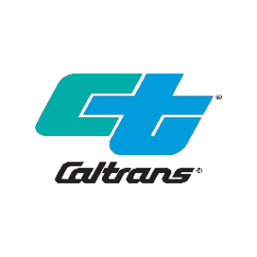

<html lang="en">
<head>
        
</head>
<body>
    <!-- Header Section -->
    

        <!-- Profile Image -->
        

        <!-- Name and Subtitle -->
        

            
Vinay Kumar Reddy Gadila

            
Java Full Stack Developer

        

    

</body>
</html>

**Phone**: (513) 916-4463  
**E-Mail**: [Vinaykrgadila@gmail.com](mailto:Vinaykrgadila@gmail.com)  
[LinkedIn](https://www.linkedin.com/in/vinayreddygadila) | [GitHub](https://github.com/Vinay321a) | [Personal Website](https://vinay321a.github.io/Portfolio/)  

---

## Professional Summary

With around **7 years of experience** as a Full Stack Java Developer, I have worked in industries such as **Retail, Healthcare, Banking & Insurance,** and the **Government Sector**, building scalable, high-performance applications. Below are some highlights:

- **Java Expertise**: Extensive knowledge in Core Java, J2EE, Spring Framework, Hibernate, and Microservices.
- **Web Development**: Proficient in **HTML, CSS, JavaScript**, and modern frameworks such as **Angular**, **ReactJS**, and **VueJS**.
- **Cloud & DevOps**: Expertise in AWS (EC2, RDS, S3), Azure, and GCP for building cloud-based solutions and CI/CD pipelines.
- **Database Management**: Experience in relational (Oracle, MySQL, PostgreSQL) and NoSQL databases (MongoDB, Cassandra).

---

## Technical Skills

### Languages:
- C, C++, Java (J2SE, J2EE), SQL, PL/SQL, Python, Scala, Go, Kotlin, Groovy

### Frameworks & Tools:
- **J2EE**: Spring, Spring Boot, Struts, Hibernate, JSP, Servlets
- **Web Technologies**: HTML, CSS3, JavaScript, ReactJS, Angular, VueJS, Node.js, ExpressJS, Bootstrap
- **Cloud Platforms**: AWS (EC2, S3, RDS), Azure, GCP
- **Database**: Oracle, MS SQL Server, MySQL, PostgreSQL, MongoDB, Cassandra, GraphQL

### Tools:
- Git, Jenkins, Maven, Docker, Kubernetes, Terraform, JIRA, Selenium, Log4j, Postman

---

## Professional Experience

### **Client: Caltrans, San Francisco, CA** (Jan 2023 - Present)  
**Role**: Full-stack Java Developer  
**Responsibilities**:
- Designed responsive web UIs using **Angular 2**, **JavaScript**, **CSS**, and **Bootstrap**.
- Developed backend services with **Spring Boot**, **Microservices**, and integrated with **AWS Lambda** for serverless architecture.
- Worked with **GIS applications**, implemented scalable **cloud solutions** using AWS services such as **EC2**, **RDS**, and **API Gateway**.
- Integrated **VueJS** for rich client-side interactions and **RESTful APIs** using **Spring Boot**.

---

### **Client: Great American Insurance, Cincinnati, OH** (Jan 2021 - Dec 2022)  
**Role**: Full-stack Java Developer  
**Responsibilities**:
- Developed reusable **SOAP** and **RESTful APIs** for system integration using **JAX-WS**, **Spring Boot**.
- Implemented **AWS Infrastructure** with **EC2**, **S3**, **RDS**, and **SQS**.
- Integrated **GraphQL** with Java backend services for efficient data querying and created **Jenkins** pipelines for automation.

---

### **Client: Macy's, Hyderabad, TG** (July 2019 - Dec 2020)  
**Role**: Java Full Stack Developer  
**Responsibilities**:
- Implemented **microservices** architecture using **Spring Boot**, **Spring Cloud**.
- Developed interactive UIs using **ReactJS**, **Flux** for efficient Single Page Application (SPA).
- Worked on **Azure Cloud** with services like **App Service**, **Blob Storage**, and **SQL Database**.

---

### **Client: Chase, Hyderabad, TG** (Feb 2018 - Jul 2019)  
**Role**: Java Full Stack Developer  
**Responsibilities**:
- Worked on **Java 11** features such as **Lambda expressions** and **Stream API** for efficient data processing.
- Designed UI with **ReactJS** and developed microservices for tax calculations integration using **Spring Boot**.
- Configured **AWS Lambda**, **EC2**, and **RDS** for a scalable cloud-based system.

---

## Education

### **Masters in Computer Science**
University of Dayton, 2023  
---

## Key Projects

### **AWS Cloud Migration**
- Migrated legacy applications to **AWS EC2**, **S3**, and **RDS**, improving scalability and performance.
- Implemented **CloudFormation** and **Terraform** for automating infrastructure provisioning.

### **Online Banking System**
- Developed a secure, scalable **online banking platform** using **Spring Boot**, **Hibernate**, and **AngularJS**.
- Integrated **RESTful APIs** for transaction management, balance checks, and account management.

---

## Certifications

- **Microsoft Certified Azure Architect**
- **Cisco Certified CCNA**
- **Java Certification**

---

## Personal Interests

- **Open Source Contribution**: Actively contributing to various open-source projects, especially in Java and Spring ecosystems.
- **Fitness Enthusiast**: Passionate about health, fitness, and outdoor activities like hiking and cycling.

---

## Contact

Feel free to reach out for project collaborations, freelance opportunities, or just a casual tech chat.

**Phone**: (513) 916-4463  
**E-Mail**: [Vinaykrgadila@gmail.com](mailto:Vinaykrgadila@gmail.com)  
[LinkedIn](https://www.linkedin.com/in/vinayreddygadila) | [GitHub](https://github.com/Vinay321a)

<footer style="text-align: center; padding: 20px; background-color: #f1f1f1; margin-top: 50px; font-size: 16px;">
    
This webpage is created and maintained by Vinay Kumar Reddy Gadila

</footer> .

